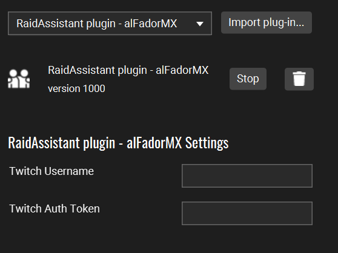
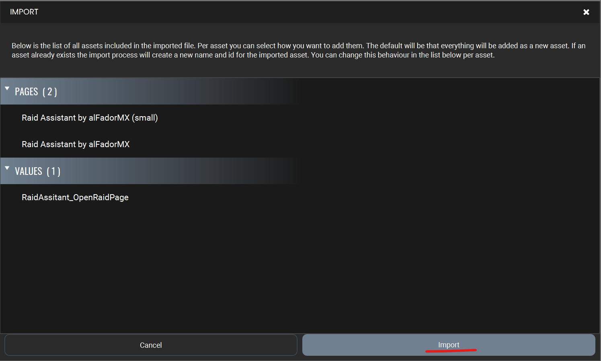

# TouchPortal RaidAssistant Plugin

Displays the top 20 streamers you follow on a custom page, allowing you to raid them from [Touch Portal](https://www.touch-portal.com/).

Just click on the streamer face to trigger a Raid.

## Features

### Settings
- `Twitch Username`: Your Twitch username.
- `Twitch Auth Token`: A Twitch Authorization token (details below).

### States
- `Total Channels Online`: Number of channels currently online.
- `Request Has Error`: Indicates if the latest request to Twitch produced an error.
- `Request Error Message`: Error message from Twitch if the latest request failed.

### Raid Information
The plugin provides the following details for up to 20 followed accounts. If an account is live, its information will be populated; otherwise, it will be empty. The followed accounts will be ordered by most viewer count.

- `Raid #01: User Id`
- `Raid #01: User Name`
- `Raid #01: User Thumbnail`
- `Raid #01: Game Name`
- `Raid #01: Title`
- `Raid #01: Short Title`: Shortened version of the title ending with "..."
- `Raid #01: Is Mature`
- `Raid #01: Thumbnail`
- `Raid #01: Viewer Count`
- `Raid #01: Url`

## Installation

As with all plugins, this requires the Touch Portal Pro version to function. Follow this [Import a Touch Portal plug-in (.tpp)](https://www.touch-portal.com/blog/post/tutorials/import-plugin-guide.php) tutorial.

To configure the plugin you need your **Twitch Username** and a **Twitch Auth Token**.

### How to Get a Twitch Auth Token

1. Close the Plugin Settings Page.
2. Click on the New Notification indicator at the top-right area in Touch Portal.
    
3. Look for the **RaidAssistant Plugin - Twitch Token Update** notification and click on Open.
    
4. Accept the permissions for the plugin to access your list of followed accounts on Twitch.
5. You will land on the **Raid Assistant plugin by alFadorMX** page. Clicking on the token will copy it automatically.
    
6. Paste the token into the plugin settings page.

**Note:** Your token needs to be refreshed periodically. The plugin will notify you in Touch Portal's notification center, and you will need to repeat this procedure.

### Import the RaidAssistant Pages

1. In the Pages area, click on the gear button to open a submenu, then select the **Import page** option.
    
2. Select the **Raid Assistant Pages.tpz2** file. The following Touch Portal window will appear:
    
3. Click on **Import**.

### Imported Pages

There are two pages that have been imported:

1. **Small Page**
    - Displays the `User Thumbnail` as the button image.
    - The button text will be the `User Name` along with the `Viewer Count`.
    - Clicking the button **once** will launch a raid and set the button font to red. Clicking the button again will cancel the raid.
    

2. **Big Page**
    - This page is more cluttered but provides more information.
    - On the left, there is a 1/3 button with the `User Thumbnail` as the button image. The button text will be the `User Name` along with the `Viewer Count`.
        - Clicking the button **once** will launch a raid and set the button font to red. Clicking the button again will cancel the raid.
    - On the right, there is a 2/3 **non-clickable** button with the `Thumbnail` as the button image. The button text will be the `Short Title` along with the `Game Name`.
    

**IMPORTANT:** Clicking the `launch a Raid` buttons will also open your web browser to the `URL`. To alter this behavior in Touch Portal, go to **Values > RaidAssistant_OpenRaidPage > Default value:** and set it to _false_, as shown in this image:

## Want to contribute?

First off, thanks for taking the time to contribute! ❤️. Read the guideliness and setup environment instructions in our [CONTRIBUTING](https://github.com/alfadormx/touchportal.plugin.streamloots/blob/main/CONTRIBUTING.md) document.

## Acknowledgements
- [TouchPortalPluginSDK](https://github.com/ChristopheCVB/TouchPortalPluginSDK)

## License

The content of this project itself is licensed under the [GPL-3.0 license](https://www.gnu.org/licenses/gpl-3.0.html).